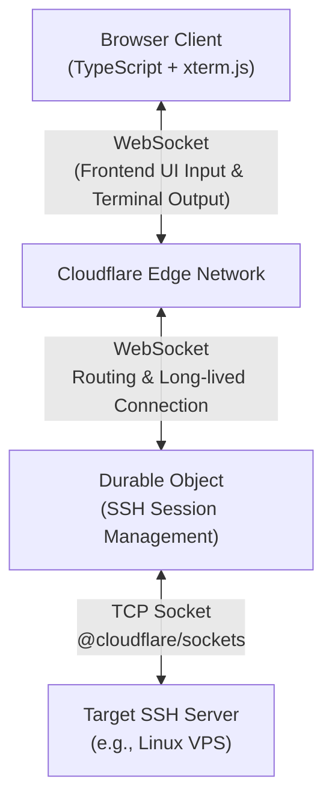

<div align="center">
  <h1>CloudSSH</h1>
  <p>A Serverless Web SSH Terminal built on Cloudflare Workers: Connect and manage your servers directly from the browser.</p>
  <p><b>Ultra-lightweight · Out-of-the-box · Cyberpunk UI</b></p>
  <p>
    <a href="https://github.com/newbietan/CloudSSH/stargazers"></a>
    <a href="LICENSE"></a>
    
    
    
  </p>
  <p>
    <a href="#highlights">Highlights</a> ·
    <a href="#features">Features</a> ·
    <a href="#quick-start">Deployment</a> ·
    <a href="#architecture">Architecture</a> ·
    <a href="#license">License</a>
  </p>
  <p>
    <a href="README.md">简体中文</a> |
    <a href="README_en.md">English</a>
  </p>
</div>

> [!TIP]
> **CloudSSH** utilizes Cloudflare Workers' TCP Sockets support to handle SSH protocol parsing and forwarding at edge nodes, providing a low-latency Web Terminal experience.

## Demo

> Imagine opening your browser anytime, anywhere, and connecting to your server with a highly futuristic cyberpunk UI, without installing any SSH client.


## Table of Contents

- [Highlights](#highlights)
- [Features](#features)
- [Architecture](#architecture)
- [Quick Deployment](#quick-start)
- [Development](#development)
- [License](#license)

<a id="highlights"></a>
## Highlights

### Ultimate Serverless

- **Zero Server Cost**: Pure frontend deployment + Cloudflare Workers, no need to build your own backend servers.
- **Edge Acceleration**: Benefit from Cloudflare's global edge network, enjoying low-latency SSH connections from anywhere.

### Out of the Box

- **One-Click Deployment**: Build and deploy the project with a single command using the Wrangler CLI.
- **Modern Frontend Stack**: TypeScript + Vite + Tailwind CSS, paired with xterm.js to provide a silky smooth terminal experience.

### Secure and Reliable

- **End-to-End Encryption**: Complete implementation of the SSH-2.0 protocol, including ECDH key exchange, Ed25519 signature authentication, and AES-256-GCM data encryption.
- **Security Hardening**: Built-in SSRF protection against IPv6 and reserved IPs, API rate limiting (anti-brute force), and local AES-GCM encryption for your stored server credentials.
- **Human Verification**: Supports Cloudflare Turnstile verification to prevent malicious bot abuse.
- **Isolated Session State**: Leveraging Cloudflare Durable Objects and the Hibernation API, every terminal session runs securely and persistently within its sandbox.

<a id="features"></a>
## Features

- **Full SSH Handshake**: Native TypeScript implementation of the SSH transport layer and user authentication protocols.
- **IPv4/IPv6 Dual Stack**: Full support for both IPv4 and IPv6 address connections, including automatic handling of IPv6 bracket notation.
- **Multiple Auth Methods**: Supports standard SSH password authentication as well as Ed25519 plaintext private key authentication.
- **MitM Protection (TOFU)**: Automatically extracts and prints the server's Host Key (SHA-256 fingerprint) on the first connection, preventing eavesdropping by malicious nodes.
- **Geek Terminal Experience**: Powered by `@xterm/xterm` and the `@xterm/addon-webgl` hardware acceleration rendering engine, ensuring silky smooth scrolling even with massive log outputs.
- **Customizable UI**: Switch seamlessly between classic terminal themes like Cyberpunk, Glacier, and Gruvbox, fully optimized for mobile devices.
- **Native File Transfer**: Integrated with `trzsz.js`. After installing [`trzsz`](https://trzsz.github.io/go) on the server, run `trz` or `tsz` in the terminal to upload/download files directly in the browser, with drag-and-drop upload support.

<a id="architecture"></a>
## Architecture



1. The user enters the host IP, username, and password on the frontend.
2. The frontend establishes a WebSocket connection with the backend Durable Object.
3. The DO receives the credentials and establishes a TCP connection with the target SSH server using `@cloudflare/sockets`.
4. The DO handles the entire SSH protocol negotiation (key exchange, password auth, etc.) in pure code and forwards the encrypted terminal data to the frontend via WebSocket.

<a id="quick-start"></a>
## Quick Deployment

### Prerequisites

- A Cloudflare account.
- Node.js environment (v18+).
- Cloudflare Workers Free Plan enabled (required for TCP Sockets and Durable Objects features).

### Steps

#### Method 1: Deploy via GitHub Integration (Recommended)

1. **Fork this repository** to your GitHub account.
2. **Configure Domain**: Before deploying, you must modify the custom domain in `wrangler.toml` to your own domain (Note: The domain must be registered or active in Cloudflare beforehand).
3. **Setup Deployment**: Log in to the Cloudflare dashboard, go to Workers & Pages to connect your GitHub account, and select the forked repository.
4. **Build Command**: During the deployment configuration, make sure to enter `npm install && npm run build:frontend` as the Build command, then deploy with one click (the build output directory can be left blank).

#### Method 2: Local CLI Deployment

1. **Clone the Repository**
   ```bash
   git clone https://github.com/newbietan/CloudSSH.git
   cd CloudSSH
   ```

2. **Install Dependencies**
   ```bash
   npm install
   ```

3. **Login to Cloudflare**
   ```bash
   npx wrangler login
   ```

4. **One-Click Deploy**
   ```bash
   npm run deploy
   ```

Once deployed, Wrangler will output your Worker URL. Open that URL in your browser to start using your Web SSH terminal.

#### Optional: Configure Turnstile Human Verification

To prevent malicious bot abuse, it is recommended to enable Cloudflare Turnstile verification:

1. **Create Turnstile Widget**: Log in to [Cloudflare Dashboard](https://dash.cloudflare.com/), go to the Turnstile page and create a new Widget.
2. **Get Keys**: After creation, you will receive a **Site Key** (public) and a **Secret Key** (private).
3. **Configure Environment Variables**:
   - **Method 1 (GitHub)**: In the Cloudflare Dashboard Workers settings, add the following environment variables:
     - `TURNSTILE_SECRET` = your Secret Key
     - `TURNSTILE_SITEKEY` = your Site Key
   - **Method 2 (CLI)**: Uncomment `TURNSTILE_SECRET` and `TURNSTILE_SITEKEY` in `wrangler.toml` and enter your keys.
4. **Redeploy**: Run the deployment command to apply the configuration.

> **Note**: Turnstile verification is session-level. After verification, all features are available for the current session. Closing the browser will require re-verification.

#### Optional: Configure GitHub OAuth Login & Server Management

With GitHub OAuth enabled, users can log in with their GitHub account and save/manage their frequently used SSH servers in a personal dashboard for one-click connections. When not configured, this feature is automatically hidden and does not affect the anonymous SSH connection functionality.

1. **Create a GitHub OAuth App**:
   - Go to GitHub → Settings → Developer settings → OAuth Apps → [New OAuth App](https://github.com/settings/applications/new)
   - **Application name**: `CloudSSH` (customizable)
   - **Homepage URL**: `https://your-domain.com` (your deployed domain)
   - **Authorization callback URL**: `https://your-domain.com/api/auth/callback`
   - After creation, note the **Client ID**, then click **Generate a new client secret** to get the **Client Secret** (shown only once, save it immediately)

2. **Configure Environment Variables**:
   - **Method 1 (GitHub)**: In the Cloudflare Dashboard Workers settings, add:
     - `GITHUB_CLIENT_ID` = your Client ID
     - `BASE_URL` = `https://your-domain.com` (your deployed domain)
   - **Method 2 (CLI)**: Uncomment `GITHUB_CLIENT_ID` and `BASE_URL` in `wrangler.toml` and enter your values.

3. **Set Secrets (Sensitive Information)**:
   - After deploying the project, go to Cloudflare Dashboard → your Worker project (`cloudssh`) → **Settings** → **Variables and Secrets**.
   - Click **Add** under Environment Variables:
     - **Type**: Select **Secret** (Important: Do not select Text)
     - **Variable name**: `GITHUB_CLIENT_SECRET`
     - **Value**: Paste your Client Secret
   - Click **Save and deploy**.

4. **Redeploy**: If you just added the variables and are enabling the feature for the first time, you must delete the old deployment and redeploy to initialize the database.

> **Note**: Server credentials (passwords/private keys) are encrypted with AES-256-GCM before storage. The local encryption key is automatically generated and safely stored in the database (you can also manually override it by setting `SESSION_SECRET` in environment variables). During connection, credentials never pass through the frontend — they are securely transmitted via a one-time-token mechanism.

> **Important**: Enabling this feature for the first time requires a clean deployment (delete the old Worker first, then redeploy) to initialize the new Durable Object. Use `npx wrangler delete cloudssh` to remove the old Worker, then run `npm run deploy` to redeploy.

<a id="development"></a>
## Development

This project consists of two parts:
1. **Frontend**: Located in the `frontend/` directory, built with Vite.
2. **Worker**: Located in the `src/` directory, containing the Cloudflare Worker entry point and the core SSH protocol implementation.

For local development, you can run:
```bash
npm run dev
```
This command starts Wrangler's local development environment server.

<a id="license"></a>
## License

This project is open-sourced under the [Apache License 2.0](LICENSE). 

**Special Notice**: Commercial use and modifications are permitted, but you must clearly attribute the original author.

Issues and Pull Requests are welcome to help build the community. If you find this project helpful, please consider giving it a ⭐ Star. Thank you very much for your support!

## Star History

<a href="https://www.star-history.com/?type=date&repos=newbietan%2FCloudSSH">
 <picture>
   <source media="(prefers-color-scheme: dark)" srcset="https://api.star-history.com/chart?repos=newbietan/CloudSSH&type=date&theme=dark&legend=top-left" />
   <source media="(prefers-color-scheme: light)" srcset="https://api.star-history.com/chart?repos=newbietan/CloudSSH&type=date&legend=top-left" />
   
 </picture>
</a>
